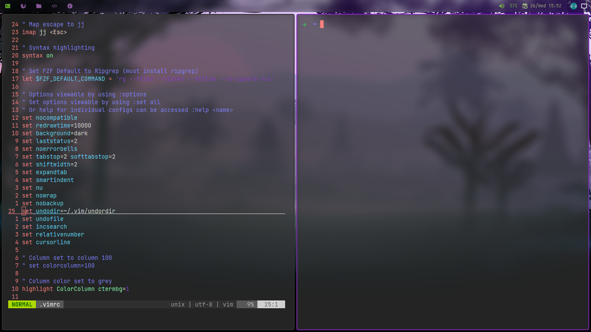

# EndeavourOS


## Installation

```bash
sudo pacman -Suy && sudo pacman -S git
```

---

## [You can install this.](https://github.com/EndeavourOS-Community-Editions/bspwm)


---

### [HTTPS](https://git-scm.com/)

```bash
git clone https://github.com/Yasouko/dotfiles.git
```

### [SSH](https://docs.github.com/en/authentication/connecting-to-github-with-ssh)

```bash
git clone git@github.com:Yasouko/dotfiles.git
```

### [Github CLI](https://cli.github.com/)

```bash
gh repo clone Yasouko/dotfiles
```

## [Run setup.sh file](https://docs.fileformat.com/programming/sh/)

```bash
./setup.sh
```


