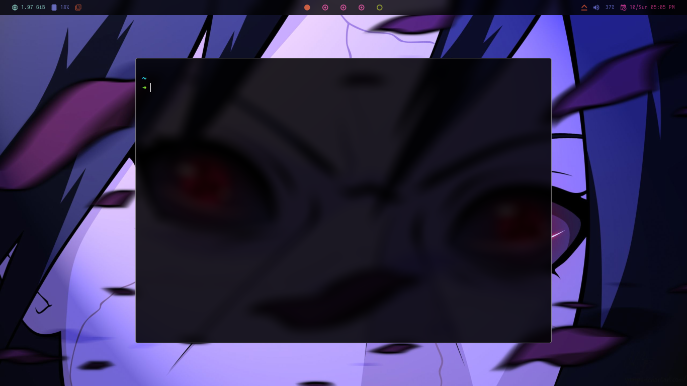

# EndeavourOS



## Installation

```bash
sudo pacman -Suy && sudo pacman -S git
```

```bash
yay -S git 
```

```bash
yay -S picom-ibhagwan-git

```

---

## [First Install Zsh and Ohmyzsh](https://ohmyz.sh/#install) 

---

### <u> zsh-syntax-highlighting </u>

```bash
git clone https://github.com/zsh-users/zsh-syntax-highlighting.git ${ZSH_CUSTOM:-~/.oh-my-zsh/custom}/plugins/zsh-syntax-highlighting
```

### <u> zsh-autosuggestions </u>
```bash
git clone https://github.com/zsh-users/zsh-autosuggestions ${ZSH_CUSTOM:-~/.oh-my-zsh/custom}/plugins/zsh-autosuggestions
```

---

### [HTTPS](https://git-scm.com/)

```bash
git clone https://github.com/Yasouko/dotfile.git
```

### [SSH](https://docs.github.com/en/authentication/connecting-to-github-with-ssh)

```bash
git clone git@github.com:Yasouko/dotfile.git
```
